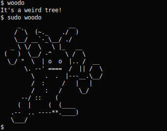

# woodo
It's a weird tree!



## Description
A program written in C that displays this weird tree that lives in your computer.

The printing of the tree is obfuscated, so that the tree will not show up if you
run ```strings``` on the compiled binary.

## Building and Installing
- Clone or download the repository
- Run ```make```
- I suggest copying the binary to ```/usr/local/bin```
